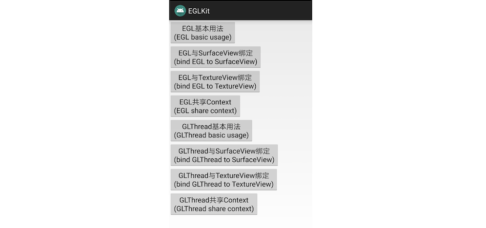

### GLKit

`GLKit`是一个`EGL`和`GLThread`线程封装库，可以方便地创建`EGL`环境，里面的`GLThread`封装可更方便地使用带有`EGL`环境的线程。

主要有2个类，一个是`EGL`，一个是`GLThread`：

`EGL`类是对`EGL`环境创建使用的封装，它可以创建`window surface`和`pbuffer surface`，不同`EGL`之间还可以共享`context`。

`GLThread`是一个带有`EGL`环境的线程封装类，通常称作`GL`线程，每个线程有自己的`EGL`环境，不同`GLThread`之间也可以共享`context`。

另外，还有些常用`GL`操作的封装，如`texture`和`bitmap`的互相转换等。

使用方法：

首先在项目根gradle中配置`jitpack`：

```
allprojects {
    repositories {
        ...
        maven { url 'https://www.jitpack.io' }
    }
}
```

然后在需要使用`FunRenderer`的模块gradle中配置依赖：

```
dependencies {
    implementation 'com.github.kenneycode:GLKit:1.0.0'
}
```


`demo`中有详细的例子，欢迎查阅：

